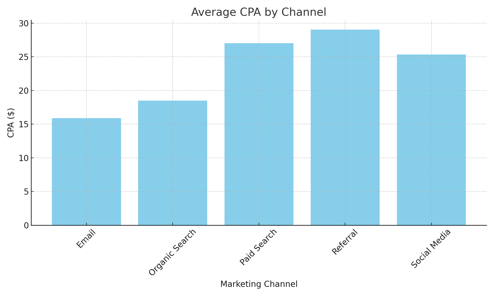

# Marketing Performance Report Script

This project analyzes multi-channel marketing data using Python, calculates key metrics, and visualizes CPA by channel.

---

## 📊 What It Does

- Aggregates 4 weeks of mock marketing data across 5 channels
- Calculates total sessions, conversions, average CPA, and conversion rate
- Outputs:
  - A summary `.csv` file
  - A bar chart image for CPA by channel

---

## 📂 Files

| File                          | Purpose                                   |
|------------------------------|-------------------------------------------|
| `report_script.py`           | Main Python script                        |
| `marketing_channel_summary.csv` | Summary table of campaign performance  |
| `average_cpa_by_channel.png` | Bar chart visualizing average CPA         |

---

## 📈 Example Chart



---

## ▶️ How to Use

1. Run `report_script.py` in Python 3
2. Make sure `pandas` and `matplotlib` are installed:
   ```bash
   pip install pandas matplotlib
